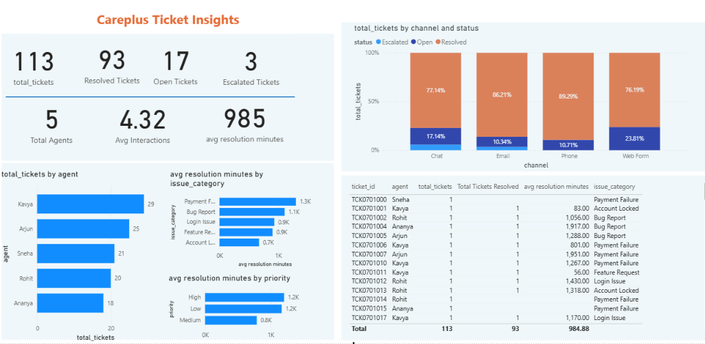
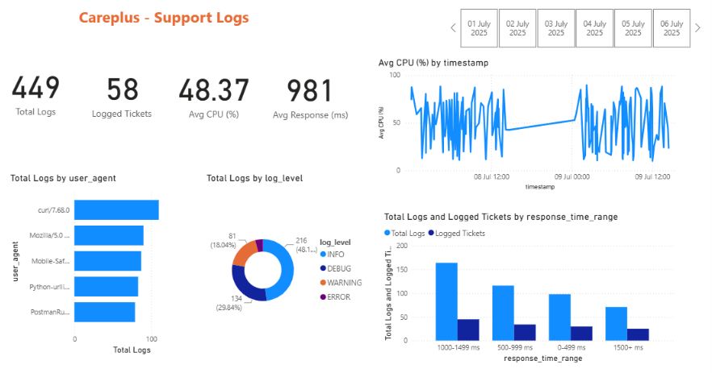

# 🚀 CarePlus AWS Data Pipeline

An end-to-end **AWS Data Engineering project** that demonstrates how customer support ticket data and application log data can be ingested, processed, transformed, stored, queried, and visualized using AWS cloud services.

The project implements a cloud-based data pipeline using **Amazon S3, AWS Lambda, AWS Glue, Amazon Athena, Amazon Redshift, MySQL, and Power BI**.

---

## 📌 Project Overview

**CarePlus AWS Data Pipeline** is designed to process two types of operational data:

* 🎫 Customer support ticket data
* 📋 Application/support log data

The pipeline follows a layered data architecture where raw data is stored in Amazon S3, transformed using serverless and managed AWS services, cataloged for analytics, loaded into a data warehouse, and finally visualized through Power BI dashboards.

### Main Pipeline

```text
                    ┌──────────────────┐
                    │   MySQL Database │
                    │ Support Tickets  │
                    └────────┬─────────┘
                             │
                             ▼
                    ┌──────────────────┐
                    │   Amazon S3      │
                    │   Raw Layer      │
                    └────────┬─────────┘
                             │
                             ▼
                    ┌──────────────────┐
                    │    AWS Glue      │
                    │  ETL Processing  │
                    └────────┬─────────┘
                             │
                             ▼
                    ┌──────────────────┐
                    │   Amazon S3      │
                    │ Processed Layer  │
                    └────────┬─────────┘
                             │
                  ┌──────────┴──────────┐
                  ▼                     ▼
          ┌───────────────┐     ┌───────────────┐
          │ Amazon Athena │     │ Amazon        │
          │ SQL Analytics │     │ Redshift      │
          └───────────────┘     │ Data Warehouse│
                                └───────┬───────┘
                                        │
                                        ▼
                                ┌───────────────┐
                                │   Power BI    │
                                │  Dashboards   │
                                └───────────────┘
```

### Application Log Pipeline

```text
Application / Support Logs
          │
          ▼
       Amazon S3
       Raw Layer
          │
          ▼
      AWS Lambda
  Data Cleaning & ETL
          │
          ▼
       Parquet
    Processed Layer
          │
          ▼
      AWS Glue
   Data Catalog / Crawler
          │
          ▼
    Amazon Athena
      SQL Analysis
          │
          ▼
    Amazon Redshift
          │
          ▼
       Power BI
    Log Dashboard
```

---

# 🏗️ Architecture

The project uses a cloud data lake and data warehouse architecture.


> The architecture diagram shows the flow of data from source systems through ingestion, transformation, storage, analytics, warehousing, and visualization.

---

# 🎯 Project Objectives

The main objectives of this project are:

* Build an end-to-end cloud data engineering pipeline.
* Ingest data from MySQL and application log files.
* Store raw data in Amazon S3.
* Implement data transformation and data quality checks.
* Convert processed log data into Parquet format.
* Use AWS Lambda for serverless log processing.
* Use AWS Glue for ETL processing.
* Catalog processed data using AWS Glue.
* Query data using Amazon Athena.
* Load analytics-ready data into Amazon Redshift.
* Create Power BI dashboards for business insights.
* Demonstrate practical AWS Data Engineering concepts.

---

# ☁️ AWS Services Used

| Service              | Purpose                                   |
| -------------------- | ----------------------------------------- |
| **Amazon S3**        | Cloud data lake and storage               |
| **AWS Lambda**       | Serverless processing of application logs |
| **AWS Glue**         | ETL processing and data cataloging        |
| **AWS Glue Crawler** | Discover and catalog processed data       |
| **Amazon Athena**    | Serverless SQL analytics                  |
| **Amazon Redshift**  | Cloud data warehouse                      |
| **IAM**              | Access and permissions management         |
| **CloudShell**       | AWS command-line operations               |
| **Power BI**         | Data visualization and dashboards         |
| **MySQL**            | Source relational database                |

---

# 📂 Repository Structure

```text
careplus-aws-data-pipeline/
│
├── architecture/
│   └── AWS-architecture-diagram.svg
│
├── dashboard/
│   ├── powerbi_tickets.png
│   └── powerbi_logs.png
│
├── data-ingestion/
│   ├── support-tickets/
│   └── support-logs/
│
├── data-transformation/
│   ├── lambda/
│   └── glue/
│
├── data-warehousing-analytics/
│   ├── athena/
│   └── redshift/
│
├── .gitignore
└── README.md
```

---

# 🔄 Data Pipeline Workflow

## 1️⃣ Data Source

The project uses two main data sources.

### Support Ticket Data

Support ticket information is maintained in a MySQL database.

Example attributes include:

```text
ticket_id
created_at
resolved_at
agent
priority
num_interactions
issue_category
channel
status
```

### Application Logs

Application/support logs contain operational information such as:

```text
timestamp
log_level
component
ticket_id
session_id
ip
response_time
cpu
event_type
error
user_agent
message
debug
```

---

# 2️⃣ Data Ingestion

The ingestion layer is responsible for moving source data into Amazon S3.

### Support Tickets

Support ticket data is extracted from MySQL and stored in the S3 raw layer.

Example:

```text
support-tickets/
└── raw/
    └── support_tickets_YYYY-MM-DD.csv
```

### Application Logs

Application logs are uploaded into the raw S3 location.

```text
support-logs/
└── raw/
    ├── log files
    └── daily application logs
```

The raw layer preserves the original incoming data before transformation.

---

# 3️⃣ Amazon S3 Data Lake

Amazon S3 acts as the central storage layer.

The project follows a raw and processed data organization.

```text
S3
│
├── support-tickets/
│   ├── raw/
│   └── processed/
│
└── support-logs/
    ├── raw/
    └── processed/
```

### Raw Layer

Contains source data in its original format.

Examples:

* CSV
* Application logs

### Processed Layer

Contains cleaned and transformed data.

For application logs, the processed data is stored in:

```text
Parquet
```

with compression for efficient analytical processing.

---

# 4️⃣ AWS Lambda – Log Processing

AWS Lambda is used for serverless processing of application/support log files.

The Lambda function is triggered when new data is available in the S3 raw log location.

### Processing Flow

```text
S3 Raw Logs
     │
     ▼
AWS Lambda
     │
     ├── Read log data
     ├── Parse records
     ├── Remove duplicates
     ├── Remove invalid records
     ├── Validate response time
     ├── Convert data types
     └── Write Parquet
     │
     ▼
S3 Processed Logs
```

### Data Quality Checks

The processing includes checks such as:

* Parsing valid records
* Removing duplicate records
* Removing records with invalid response times
* Converting timestamps to appropriate data types
* Structuring log fields
* Writing analytics-ready Parquet data

---

# 5️⃣ Parquet Processing

Processed application logs are converted from raw log format into **Parquet**.

Parquet provides an efficient columnar format for analytical workloads.

Example:

```text
support-logs/
└── processed/
    └── daily/
        └── *.parquet
```

The processed data uses **Snappy compression**.

This makes the data more suitable for querying through Athena and downstream analytics.

---

# 6️⃣ AWS Glue ETL – Support Tickets

AWS Glue is used to transform support ticket data.

The Glue ETL process performs operations such as:

* Reading raw ticket data
* Schema handling
* Data cleaning
* Column standardization
* Data transformation
* Preparing warehouse-ready data
* Writing processed data

The processed ticket data is stored back in Amazon S3.

```text
MySQL
  │
  ▼
S3 Raw
  │
  ▼
AWS Glue ETL
  │
  ▼
S3 Processed
  │
  ▼
Redshift
```

---

# 7️⃣ AWS Glue Data Catalog

AWS Glue Data Catalog provides metadata information about the processed datasets.

A Glue crawler is used to discover the schema of the processed data.

For example:

```text
Database:
careplus_db

Table:
support_logs_processed
```

The catalog allows analytical services such as Amazon Athena to understand the structure of the data stored in S3.

---

# 8️⃣ Amazon Athena

Amazon Athena is used to query the processed data directly from Amazon S3 using SQL.

Example analytical questions include:

* How many support logs were generated?
* What are the most common log levels?
* Which components generate the most errors?
* What is the average response time?
* Which dates have the highest number of logs?
* Which issue categories occur most frequently?

Example:

```sql
SELECT
    log_level,
    COUNT(*) AS total_logs
FROM support_logs_processed
GROUP BY log_level
ORDER BY total_logs DESC;
```

---

# 9️⃣ Amazon Redshift Data Warehouse

Amazon Redshift is used as the analytical data warehouse.

The project loads transformed datasets into Redshift tables.

### Support Ticket Table

```text
public.support_tickets
```

Important fields include:

```text
ticket_id
created_at
resolved_at
agent
priority
num_interactions
issue_category
channel
status
```

### Support Log Table

```text
public.support_logs
```

The warehouse provides a structured environment for analytical queries and BI reporting.

---

# 🔟 Data Quality

Data quality checks are incorporated into the pipeline.

Examples include:

### Duplicate Removal

Duplicate records are identified and removed during log processing.

### Invalid Response Time

Records containing negative response times are removed.

### Schema Validation

Columns are validated and standardized before loading into downstream systems.

### Data Type Conversion

Fields such as timestamps and numeric values are converted into appropriate data types.

### Processing Validation

Processed row counts are checked before downstream loading.

---

# 📊 Pipeline Validation

The application log pipeline was tested using daily log data.

Example processing results:

| Date       | Parsed Records | Duplicate Records Removed | Invalid Records Removed | Final Records |
| ---------- | -------------: | ------------------------: | ----------------------: | ------------: |
| 2025-07-01 |            105 |                         9 |                       7 |            89 |
| 2025-07-08 |            101 |                         — |                       — |            85 |
| 2025-07-09 |            107 |                         — |                       — |            91 |

The processed data was successfully queried through Athena and loaded into Amazon Redshift.

The Redshift support log table was validated with **265 processed records** across the tested data.

---

# 📈 Power BI Dashboards

The processed data is used to build Power BI dashboards for monitoring support operations and application logs.

## 🎫 Support Ticket Dashboard

The ticket dashboard provides insights into areas such as:

* Total support tickets
* Ticket status
* Priority distribution
* Issue categories
* Support channels
* Agent performance
* Ticket trends



---

## 📋 Application Log Dashboard

The application log dashboard provides insights into:

* Total log records
* Log levels
* Error events
* Response time
* Application components
* CPU usage
* Event types
* Daily log trends



---

# 🧱 Data Architecture Layers

The project can be understood using the following data engineering layers:

```text
┌──────────────────────────────┐
│          SOURCES             │
│ MySQL + Application Logs     │
└──────────────┬───────────────┘
               │
               ▼
┌──────────────────────────────┐
│       INGESTION LAYER        │
│        Amazon S3 Raw         │
└──────────────┬───────────────┘
               │
               ▼
┌──────────────────────────────┐
│    TRANSFORMATION LAYER      │
│     Lambda + AWS Glue        │
└──────────────┬───────────────┘
               │
               ▼
┌──────────────────────────────┐
│         STORAGE LAYER        │
│     S3 Processed / Parquet   │
└──────────────┬───────────────┘
               │
          ┌────┴─────┐
          ▼          ▼
┌───────────────┐ ┌───────────────┐
│    Athena     │ │   Redshift    │
│ SQL Analytics │ │ Data Warehouse│
└───────────────┘ └───────┬───────┘
                          │
                          ▼
                 ┌─────────────────┐
                 │    Power BI     │
                 │   Dashboards    │
                 └─────────────────┘
```

---

# 🛠️ Technologies

### Programming

* Python
* SQL

### Databases

* MySQL
* Amazon Redshift

### AWS

* Amazon S3
* AWS Lambda
* AWS Glue
* AWS Glue Data Catalog
* Amazon Athena
* Amazon Redshift
* IAM
* AWS CloudShell

### Data Formats

* CSV
* Parquet

### Analytics

* Power BI
* SQL

### Development Tools

* Git
* GitHub
* VS Code

---

# 💡 Key Data Engineering Concepts Demonstrated

This project demonstrates practical knowledge of:

* ETL pipelines
* Cloud data lakes
* Data warehouses
* Serverless data processing
* Batch processing
* Event-driven processing
* Data quality
* Schema management
* Data cataloging
* SQL analytics
* Columnar storage
* Parquet
* Data warehouse loading
* Business intelligence
* Cloud-based data architecture

---

# 🔐 Security Considerations

The project uses AWS IAM roles and permissions to control access between AWS services.

Sensitive credentials and environment-specific configuration are excluded from GitHub using `.gitignore`.

Examples of files that should not be committed include:

```text
.env
*.pem
credentials
AWS access keys
database passwords
```

---

# 📌 Important Implementation Details

### S3 Bucket

```text
careplus-database-store
```

### AWS Region

```text
us-east-1
```

### Glue ETL Job

```text
automate_etl_support_tickets
```

### Glue IAM Role

```text
glue_support_tickets
```

### Glue Database

```text
careplus_db
```

### Athena Table

```text
support_logs_processed
```

### Redshift Tables

```text
public.support_tickets
public.support_logs
```

---

# 🔍 Example SQL Analytics

### Total Support Tickets

```sql
SELECT COUNT(*) AS total_tickets
FROM support_tickets;
```

### Tickets by Status

```sql
SELECT
    status,
    COUNT(*) AS total_tickets
FROM support_tickets
GROUP BY status
ORDER BY total_tickets DESC;
```

### Tickets by Priority

```sql
SELECT
    priority,
    COUNT(*) AS total_tickets
FROM support_tickets
GROUP BY priority
ORDER BY total_tickets DESC;
```

### Logs by Level

```sql
SELECT
    log_level,
    COUNT(*) AS total_logs
FROM support_logs
GROUP BY log_level
ORDER BY total_logs DESC;
```

### Average Response Time

```sql
SELECT
    AVG(response_time) AS avg_response_time
FROM support_logs;
```

---

# 🚀 Future Improvements

Possible future improvements include:

* Implement Apache Airflow or Amazon MWAA for workflow orchestration.
* Add incremental processing for all datasets.
* Implement automated monitoring and alerting.
* Add AWS CloudWatch monitoring.
* Implement CI/CD for ETL code.
* Add automated data quality testing.
* Improve Redshift loading with optimized staging and COPY workflows.
* Add partitioning strategies for large datasets.
* Implement infrastructure as code using Terraform or AWS CloudFormation.
* Add automated Power BI dataset refresh.
* Introduce data lineage and pipeline monitoring.

---

# 📚 What I Learned

Through this project, I gained hands-on experience with:

* Designing an end-to-end AWS data pipeline
* Working with Amazon S3 as a data lake
* Building serverless ETL using AWS Lambda
* Building ETL workflows using AWS Glue
* Working with Parquet data
* Creating Glue Data Catalog tables
* Querying S3 data with Athena
* Loading data into Amazon Redshift
* Performing SQL-based analytics
* Connecting processed data to Power BI
* Implementing basic data quality checks
* Organizing a real-world data engineering project using Git and GitHub

---

# 👩‍💻 Author

**Samruddhi Lad**

Electronics and Computer Engineering Graduate
Aspiring Data Engineer

### Skills

```text
Python | SQL | MySQL | AWS | S3 | Lambda | Glue |
Athena | Redshift | Power BI | Git | GitHub
```

---

# ⭐ Project Highlights

```text
✓ End-to-end AWS Data Engineering Pipeline
✓ Amazon S3 Data Lake
✓ Serverless AWS Lambda Processing
✓ AWS Glue ETL
✓ Parquet Data Processing
✓ Glue Data Catalog
✓ Athena SQL Analytics
✓ Amazon Redshift Data Warehouse
✓ Power BI Dashboards
✓ Data Quality Checks
✓ GitHub Portfolio Project
```

---

## 📌 Project Summary

**CarePlus AWS Data Pipeline** demonstrates how raw operational data can be transformed into analytics-ready information using AWS cloud technologies.

The project combines **data ingestion, cloud storage, serverless processing, ETL, data cataloging, SQL analytics, data warehousing, and business intelligence** into a single end-to-end data engineering workflow.
